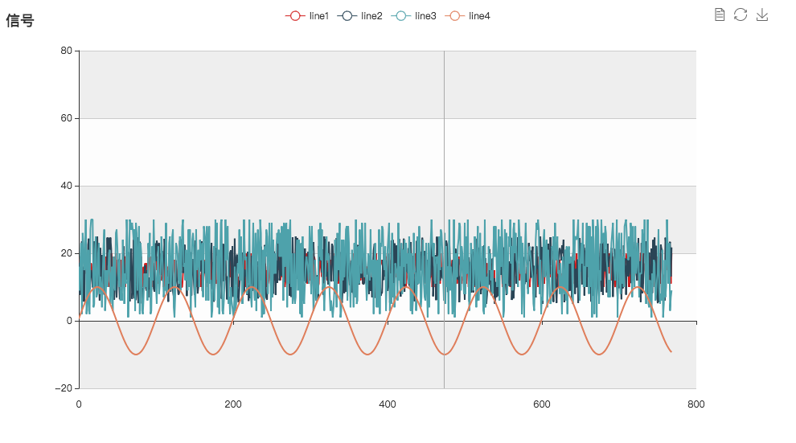

# EEL-ECHARTS Plotter
a plotter application using [eel](https://github.com/ChrisKnott/Eel) and [echarts](http://www.echartsjs.com/index.html).   

This is just a simple example shows how to use a python server and a html front-end to plot data.
